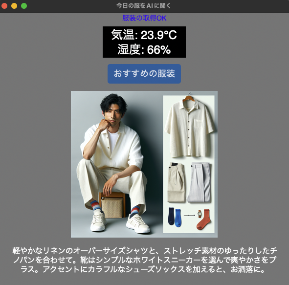

# smart-ai-clothing
  
## 概要
SwithBotの温湿度計から気温と湿度を取得  
設定から年齢、性別、暑がり・寒がり、服装のジャンルを設定することで  
適切な服装の画像とアドバイスを表示するアプリ  
  
## 言語
Python

## 実行
```
python app.py
```
  
## その他
.envにトークンとデバイスIDを設定  
年齢や性別などは設定可。その他は今後設定できるようにします
※現在、服装の取得1回のコスト0.04ドル(6円)
　
## 画面イメージ
